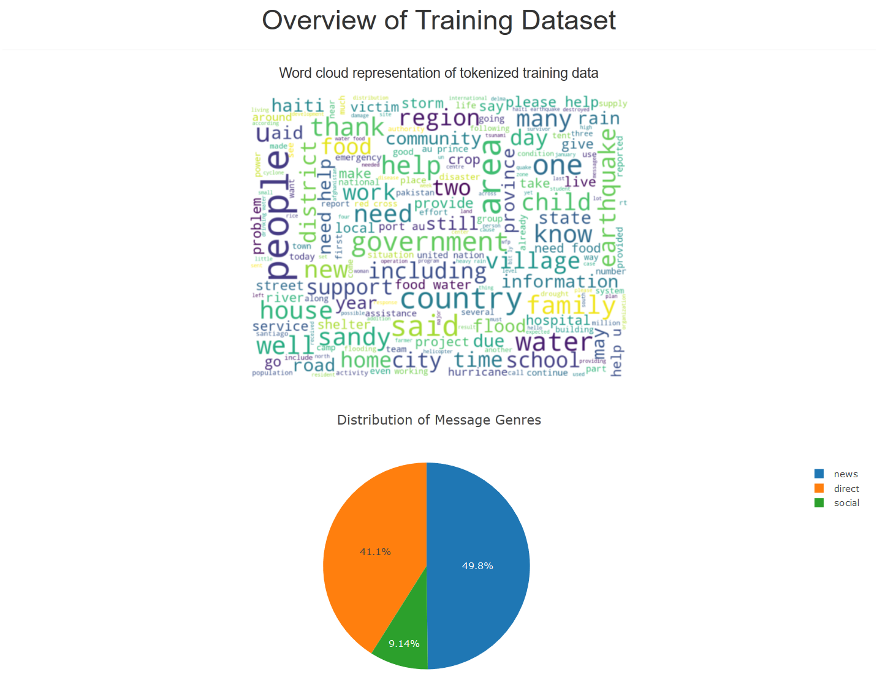

# Disaster Response Pipeline Project

## Web deployment:
https://disaster-response-sys.herokuapp.com

## About
The goal of this project is to create a prototype capable of labeling short messages in emergency scenarios, such that first responders are provided with a clear stream of information as quickly as possible. The dataset was provided by Udacity in collaboration with Figure Eight, and contains pre-labeled tweets and messages from a wide range of previously occured real-life distasters. A Natural Language Processing (NLP) pipeline transforms raw messages into multi-output predictions with the default classifier AdaBoost. Other options include k-nearest neighbors and random forest.

Project breakdown:
1. **Data processing:** Extract Transform Load (ETL) pipeline; takes several csv files and merges them into a dedicated SQLite DB.
2. **ML pipeline:** takes the processed data and applies NLP to provide message categories.
3. **Web dashboard:** displays model performance and training data statistics.

## Dependencies

* Python 3.8
* Database: SQLalchemy
* NLP: NLTK
* ML: NumPy, Pandas, Scikit-Learn
* Web: Flask, Plotly, Wordcloud, Heroku

## File breakdown 

* data/process_data.py - ETL Pipeline
* model/train_classifier.py - ML pipeline with grid search and cross-validation
* utils/train_utils.py - Additional class with training and visualization utilities
* app/run.py - Flask app
* app/templates - HTML pages
* start.py - Heroku starting script

The datasets originate from Figure Eight.

## Instructions:
1. Clone the repository.
2. Install dependencies.
3. Run the following commands in the project's root directory to set up a database and model.

    - To run ETL pipeline that cleans data and stores in database:
    
        `python data/process_data.py data/disaster_messages.csv data/disaster_categories.csv data/DisasterResponse.db`
    - To run ML pipeline that trains classifier and saves the model:
    
        `python models/train_classifier.py data/DisasterResponse.db models/classifier.pkl`
        
4. Run the following command in the project's root directory to start the web app:

    `python app/run.py`

5. Go to http://localhost:3001/
6. OPTIONAL: For deploying it to Heroku, start.py serves as the entry point.

## Examples

1. Input message example:

2. Classification results:

3. Training data statistics:

## Acknowledgments
Thanks to the Udacity team for the good guidance and a well-made course. In addition, I'd like to thank Figure Eight for providing the dataset used in the project.
